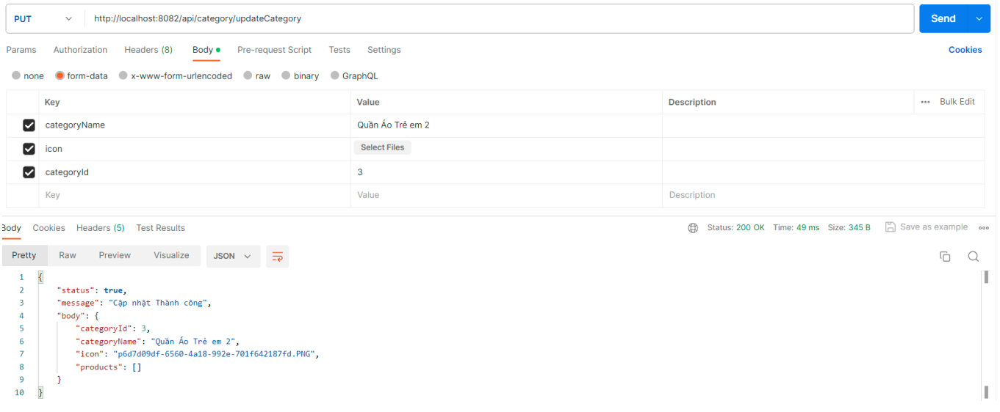
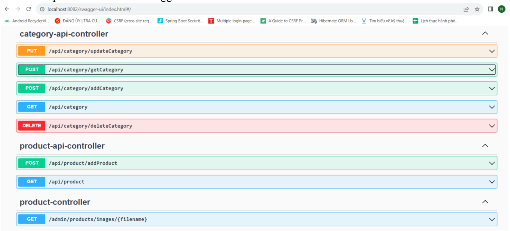
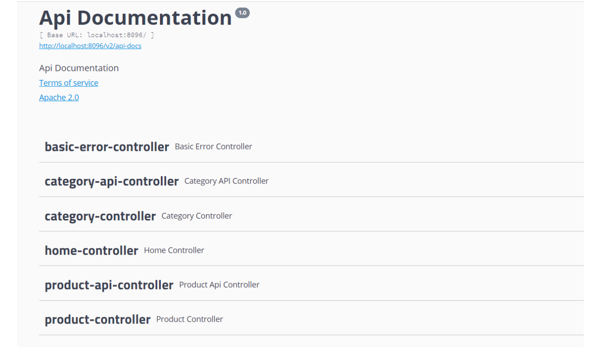

# 1. HƯỚNG DẪN CRUD API CATEGORY TRÊN SPRING BOOT 3.1.5
## Bước 1: thêm thư viện upload file và swagger 3
<!--cấu hình file upload-->
<dependency>
<groupId>org.springframework.boot</groupId>
<artifactId>spring-boot-configuration-processor</artifactId>
<optional>true</optional>
</dependency>
<!-- https://mvnrepository.com/artifact/commons-io/commons-io -->
<dependency>
<groupId>commons-io</groupId>
<artifactId>commons-io</artifactId>
<version>2.11.0</version>
</dependency>
<!-- swagger3 -->
<dependency>
<groupId>io.springfox</groupId>
<artifactId>springfox-swagger-ui</artifactId>
<version>3.0.0</version>
</dependency>
<dependency>
<groupId>org.springdoc</groupId>
<artifactId>springdoc-openapi-starter-webmvc-ui</artifactId>
<version>2.0.2</version>
</dependency>

## Bước 2: Xây dựng Entity Category và product
package webprog.entity;
import java.io.Serializable;
import java.util.Set;
import jakarta.persistence.*;
import lombok.*;
@Data
@AllArgsConstructor
@NoArgsConstructor
@Entity
@Table(name = "Categories")
public class Category implements Serializable{
private static final long serialVersionUID = 1L;
@Id
@GeneratedValue(strategy = GenerationType.IDENTITY)
private Long categoryId;
private String categoryName;
private String icon;
@JsonIgnore
@OneToMany(mappedBy = "category", cascade = CascadeType.ALL )
private Set<Product> products;
}
=================
package webprog.entity;
import java.io.Serializable;
import java.util.Date;
import org.springframework.format.annotation.DateTimeFormat;
import jakarta.persistence.*;
import lombok.*;
@Data
@AllArgsConstructor
@NoArgsConstructor
@Entity
@Table(name = "Products")
public class Product implements Serializable {
private static final long serialVersionUID = 1L;
@Id
@GeneratedValue(strategy = GenerationType.IDENTITY)
private Long productId;
@Column(length = 500, columnDefinition = "nvarchar(500) not null")
private String productName;
@Column(nullable = false)
private int quantity;
@Column(nullable = false)
private double unitPrice;
@Column(length = 200)
private String images;
@Column(columnDefinition = "nvarchar(500) not null")
private String description;
@Column(nullable = false)
private double discount;
@Temporal(TemporalType.TIMESTAMP)
@DateTimeFormat(pattern = "YYYY-MM-DD hh:mi:ss")
private Date createDate;
@Column(nullable = false)
private short status;
@JsonIgnore
@ManyToOne
@JoinColumn(name="categoryId")
private Category category;
}

## Bước 3: Xây dựng Responsitory
package webprog.repository;
import java.util.List;
import java.util.Optional;
import org.springframework.data.domain.Page;
import org.springframework.data.domain.Pageable;
import org.springframework.data.jpa.repository.JpaRepository;
import org.springframework.stereotype.Repository;
import webprog.entity.Category;
@Repository
public interface CategoryRepository extends JpaRepository<Category, Long > {
//Tìm Kiếm theo nội dung tên
List<Category> findByCategoryNameContaining(String name);
//Tìm kiếm và Phân trang
Page<Category> findByCategoryNameContaining(String name,Pageable pageable);
Optional<Category> findByCategoryName(String name);
}
===============
package webprog.repository;
import java.util.Date;
import java.util.List;
import java.util.Optional;
import org.springframework.data.domain.Page;
import org.springframework.data.domain.Pageable;
import org.springframework.data.jpa.repository.JpaRepository;
import org.springframework.stereotype.Repository;
import webprog.entity.Product;
@Repository
public interface ProductRepository extends JpaRepository<Product, Long> {
//Tìm Kiếm theo nội dung tên
List<Product> findByProductNameContaining(String name);
//Tìm kiếm và Phân trang
Page<Product> findByProductNameContaining(String name,Pageable
pageable);
Optional<Product> findByProductName(String name);
Optional<Product> findByCreateDate(Date createAt);
}

## Bước 4: Xây dựng tầng service
package webprog.service;
import java.util.List;
import java.util.Optional;
import org.springframework.data.domain.Example;
import org.springframework.data.domain.Page;
import org.springframework.data.domain.Pageable;
import org.springframework.data.domain.Sort;
import webprog.entity.Category;
public interface ICategoryService {
void delete(Category entity);
void deleteById(Long id);
long count();
<S extends Category> Optional<S> findOne(Example<S> example);
Optional<Category> findById(Long id);
List<Category> findAllById(Iterable<Long> ids);
List<Category> findAll(Sort sort);
Page<Category> findAll(Pageable pageable);
List<Category> findAll();
Optional<Category> findByCategoryName(String name);
<S extends Category> S save(S entity);
Page<Category> findByCategoryNameContaining(String name, Pageable pageable);
List<Category> findByCategoryNameContaining(String name);
}
===============
package webprog.service;
import java.util.List;
import java.util.Optional;
import org.springframework.beans.factory.annotation.Autowired;
import org.springframework.data.domain.Example;
import org.springframework.data.domain.Page;
import org.springframework.data.domain.Pageable;
import org.springframework.data.domain.Sort;
import org.springframework.stereotype.Service;
import org.springframework.util.StringUtils;
import webprog.entity.Category;
import webprog.repository.CategoryRepository;
//khai báo service
@Service
public class CategoryServiceImpl implements ICategoryService{
@Autowired
CategoryRepository categoryRepository;
//source -> Generate Constructor using Field, xóa super()
@Override
public <S extends Category> S save(S entity) {
if(entity.getCategoryId() == null) {
return categoryRepository.save(entity);
}else {
Optional<Category> opt = findById(entity.getCategoryId());
if(opt.isPresent()) {
if (StringUtils.isEmpty(entity.getIcon())) {
entity.setIcon(opt.get().getIcon());
}else {
//lấy lại images cũ
entity.setIcon(entity.getIcon());
}
}
return categoryRepository.save(entity);
}
}
@Override
public Optional<Category> findByCategoryName(String name) {
return categoryRepository.findByCategoryName(name);
}
public CategoryServiceImpl(CategoryRepository categoryRepository) {
this.categoryRepository = categoryRepository;
}
@Override
public List<Category> findAll() {
return categoryRepository.findAll();
}
@Override
public Page<Category> findAll(Pageable pageable) {
return categoryRepository.findAll(pageable);
}
@Override
public List<Category> findAll(Sort sort) {
return categoryRepository.findAll(sort);
}
@Override
public List<Category> findAllById(Iterable<Long> ids) {
return categoryRepository.findAllById(ids);
}
@Override
public Optional<Category> findById(Long id) {
return categoryRepository.findById(id);
}
@Override
public <S extends Category> Optional<S> findOne(Example<S> example) {
return categoryRepository.findOne(example);
}
@Override
public long count() {
return categoryRepository.count();
}
@Override
public void deleteById(Long id) {
categoryRepository.deleteById(id);
}
@Override
public void delete(Category entity) {
categoryRepository.delete(entity);
}
@Override
public List<Category> findByCategoryNameContaining(String name) {
return categoryRepository.findByCategoryNameContaining(name);
}
@Override
public Page<Category> findByCategoryNameContaining(String name, Pageable
pageable) {
return categoryRepository.findByCategoryNameContaining(name, pageable);
}
}

## Bước 5: Xây dựng model để hiển thị theo format
package webprog.model;
import lombok.AllArgsConstructor;
import lombok.Data;
import lombok.NoArgsConstructor;
@Data
@AllArgsConstructor
@NoArgsConstructor
public class Response {
private Boolean status;
private String message;
private Object body;
}

## Bước 6: Xây dựng hàm upload file trong spring boot
package webprog.service;
import java.nio.file.Path;
import org.springframework.core.io.Resource;
import org.springframework.web.multipart.MultipartFile;
public interface IStorageService {
void init();
void delete(String storeFilename) throws Exception;
Path load(String filename);
Resource loadAsResource(String filename);
void store(MultipartFile file, String storeFilename);
String getSorageFilename(MultipartFile file, String id);
}
=====================
package webprog.service;
import java.io.InputStream;
import java.nio.file.Files;
import java.nio.file.Path;
import java.nio.file.Paths;
import java.nio.file.StandardCopyOption;
import org.apache.commons.io.FilenameUtils;
import org.springframework.core.io.Resource;
import org.springframework.core.io.UrlResource;
import org.springframework.stereotype.Service;
import org.springframework.web.multipart.MultipartFile;
import webprog.Exception.StorageException;
import webprog.config.StorageProperties;
@Service
public class FileSystemStorageServiceImpl implements IStorageService {
private final Path rootLocation;
@Override
public String getSorageFilename(MultipartFile file, String id) {
String ext = FilenameUtils.getExtension(file.getOriginalFilename());
return "p" + id + "." + ext;
}
public FileSystemStorageServiceImpl(StorageProperties properties) {
this.rootLocation = Paths.get(properties.getLocation());
}
@Override
public void store(MultipartFile file, String storeFilename) {
try {
if(file.isEmpty()) {
throw new StorageException("Failed to store empty file");
}
Path destinationFile =
this.rootLocation.resolve(Paths.get(storeFilename))
.normalize().toAbsolutePath(); //lấy đường dẫn tuyệt
đối
if(!destinationFile.getParent().equals(this.rootLocation.toAbsolutePath())) {
throw new StorageException("Cannot store file outside
curent directory");
}
try (InputStream inputStream = file.getInputStream()) {
Files.copy(inputStream, destinationFile,
StandardCopyOption.REPLACE_EXISTING);
}
} catch (Exception e) {
throw new StorageException("Failed to store file: ", e);
}
}
@Override
public Resource loadAsResource(String filename) {
try {
Path file = load(filename);
Resource resource = new UrlResource(file.toUri());
if(resource.exists() || resource.isReadable()) {
return resource;
}
throw new StorageException("Can not read file: " + filename);
} catch (Exception e) {
throw new StorageException("Could not read file: " + filename);
}
}
@Override
public Path load(String filename) {
return rootLocation.resolve(filename);
}
@Override
public void delete(String storeFilename) throws Exception {
Path destinationFile =
rootLocation.resolve(Paths.get(storeFilename)).normalize().toAbsolutePath();
Files.delete(destinationFile);
}
@Override
public void init() {
try {
Files.createDirectories(rootLocation);
System.out.println(rootLocation.toString());
} catch (Exception e) {
throw new StorageException("Could not read file: ", e);
}
}
}
=====================
package webprog.Exception;
public class StorageException extends RuntimeException {
private static final long serialVersionUID = 1L;
public StorageException(String message) {
super(message);
}
public StorageException(String message, Exception e) {
super(message,e);
}
}
=========================
package webprog.Exception;
public class StorageFileNotFoundException extends StorageException {
private static final long serialVersionUID = 1L;
public StorageFileNotFoundException(String message) {
super(message);
}
}
====================
package webprog.config;
import org.springframework.boot.context.properties.ConfigurationProperties;
import lombok.Data;
@Data
@ConfigurationProperties("storage")
public class StorageProperties {
private String location;
}
========================
Thêm vùng màu vàng vào file chạy spring boot: ….Application.java
@SpringBootApplication
@EnableConfigurationProperties(StorageProperties.class) // thêm cấu hình storage
public class SpringbootThymeleafApplication {
public static void main(String[] args) {
SpringApplication.run(SpringbootThymeleafApplication.class, args);
}
// thêm cấu hình storage
@Bean
CommandLineRunner init(IStorageService storageService) {
return (args -> {
storageService.init();
});
}
}

## Bước 7: Viết Controller
package webprog.Controller.api;
import java.util.Optional;
import java.util.UUID;
import org.springframework.beans.factory.annotation.Autowired;
import org.springframework.http.HttpStatus;
import org.springframework.http.ResponseEntity;
import org.springframework.validation.annotation.Validated;
import org.springframework.web.bind.annotation.DeleteMapping;
import org.springframework.web.bind.annotation.GetMapping;
import org.springframework.web.bind.annotation.PostMapping;
import org.springframework.web.bind.annotation.PutMapping;
import org.springframework.web.bind.annotation.RequestMapping;
import org.springframework.web.bind.annotation.RequestParam;
import org.springframework.web.bind.annotation.RestController;
import org.springframework.web.multipart.MultipartFile;
import webprog.entity.Category;
import webprog.model.Response;
import webprog.service.ICategoryService;
import webprog.service.IStorageService;
@RestController
@RequestMapping(path = "/api/category")
public class CategoryAPIController {
@Autowired
private ICategoryService categoryService;
@Autowired
IStorageService storageService;
@GetMapping
public ResponseEntity<?> getAllCategory() {
//return ResponseEntity.ok().body(categoryService.findAll());
return new ResponseEntity<Response>(new Response(true, "Thành công",
categoryService.findAll()), HttpStatus.OK);
}
@PostMapping(path = "/getCategory")
public ResponseEntity<?> getCategory(@Validated @RequestParam("id") Long id) {
Optional<Category> category = categoryService.findById(id);
if (category.isPresent()) {
//return ResponseEntity.ok().body(category.get());
return new ResponseEntity<Response>(new Response(true, "Thành
công", category.get()), HttpStatus.OK);
} else {
//return ResponseEntity.notFound().build();
return new ResponseEntity<Response>(new Response(false, "Thất
bại", null), HttpStatus.NOT_FOUND);
}
}
@PostMapping(path = "/addCategory")
public ResponseEntity<?> addCategory(@Validated @RequestParam("categoryName")
String categoryName,
@Validated @RequestParam("icon") MultipartFile icon) {
Optional<Category> optCategory =
categoryService.findByCategoryName(categoryName);
if (optCategory.isPresent()) {
return
ResponseEntity.status(HttpStatus.BAD_REQUEST).body("Category đã tồn tại trong hệ
thống");
//return new ResponseEntity<Response>(new Response(false, "Loại
sản phẩm này đã tồn tại trong hệ thống", optCategory.get()), HttpStatus.BAD_REQUEST);
} else {
Category category = new Category();
//kiểm tra tồn tại file, lưu file
if(!icon.isEmpty()) {
UUID uuid = UUID.randomUUID();
String uuString = uuid.toString();
//lưu file vào trường Images
category.setIcon(storageService.getSorageFilename(icon,
uuString));
storageService.store(icon, category.getIcon());
}
category.setCategoryName(categoryName);
categoryService.save(category);
//return ResponseEntity.ok().body(category);
return new ResponseEntity<Response>(new Response(true, "Thêm
Thành công", category), HttpStatus.OK);
}
}
@PutMapping(path = "/updateCategory")
public ResponseEntity<?> updateCategory(@Validated @RequestParam("categoryId")
Long categoryId,
@Validated @RequestParam("categoryName") String categoryName,
@Validated @RequestParam("icon") MultipartFile icon) {
Optional<Category> optCategory = categoryService.findById(categoryId);
if (optCategory.isEmpty()) {
return new ResponseEntity<Response>(new Response(false, "Không
tìm thấy Category", null), HttpStatus.BAD_REQUEST);
}else if(optCategory.isPresent()) {
//kiểm tra tồn tại file, lưu file
if(!icon.isEmpty()) {
UUID uuid = UUID.randomUUID();
String uuString = uuid.toString();
//lưu file vào trường Images
optCategory.get().setIcon(storageService.getSorageFilename(icon, uuString));
storageService.store(icon,
optCategory.get().getIcon());
}
optCategory.get().setCategoryName(categoryName);
categoryService.save(optCategory.get());
//return ResponseEntity.ok().body(category);
return new ResponseEntity<Response>(new
Response(true, "Cập nhật Thành công", optCategory.get()), HttpStatus.OK);
}
return null;
}
@DeleteMapping(path = "/deleteCategory")
public ResponseEntity<?> deleteCategory(@Validated @RequestParam("categoryId")
Long categoryId){
Optional<Category> optCategory = categoryService.findById(categoryId);
if (optCategory.isEmpty()) {
return new ResponseEntity<Response>(new Response(false, "Không
tìm thấy Category", null), HttpStatus.BAD_REQUEST);
}else if(optCategory.isPresent()) {
categoryService.delete(optCategory.get());
//return ResponseEntity.ok().body(category);
return new ResponseEntity<Response>(new Response(true, "Xóa Thành
công", optCategory.get()), HttpStatus.OK);
}
return null;
}
}
========================
## Bước 8: kết quả
GET

POST

PUT

DELETE

đường dẫn swagger
http://localhost:8080/swagger-ui.html

# 2. HƯỚNG DẪN CRUD CATEGORY TRÊN SPRING BOOT 2.7.17
## Bước 1: thêm thư viện và cấu hình swagger2
<!-- swagger2 -->
<dependency>
<groupId>io.springfox</groupId>
<artifactId>springfox-swagger2</artifactId>
<version>2.9.2</version>
</dependency>
<dependency>
<groupId>io.springfox</groupId>
<artifactId>springfox-swagger-ui</artifactId>
<version>2.9.2</version>
</dependency>
Thêm các dòng màu vàng vào file chạy spring boot: ….Application.java
@SpringBootApplication
@EnableSwagger2
public class CosmeticApiApplication {
public static void main(String[] args) {
SpringApplication.run(CosmeticApiApplication.class, args);
}
@Bean
 public Docket SWAGGERApi() {
 return new Docket(DocumentationType.SWAGGER_2)
 //.select()

//.apis(RequestHandlerSelectors.basePackage("webprog")).build();
 .select()
 .apis(RequestHandlerSelectors.any())
 .paths(PathSelectors.any())
 .build();
 }
}
Mở file application.properties và thêm lệnh sau
spring.mvc.pathmatch.matching-strategy = ANT_PATH_MATCHER
Cấu hình sitemesh để đọc swagger 2: thêm dòng màu vàng vào class CustomSiteMeshFilter
package webprog.config;
import org.sitemesh.builder.SiteMeshFilterBuilder;
import org.sitemesh.config.ConfigurableSiteMeshFilter;
public class CustomSiteMeshFilter extends ConfigurableSiteMeshFilter {
@Override
protected void applyCustomConfiguration(SiteMeshFilterBuilder builder) {
// Assigning default decorator if no path specific decorator found
builder.addDecoratorPath("/*", "/decorators/web.jsp")
// Map decorators to specific path patterns.
.addDecoratorPath("/admin/*", "/decorators/admin.jsp")
// Exclude few paths from decoration.
.addExcludedPath("/login*").addExcludedPath("/login/*")
.addExcludedPath("/alogin*").addExcludedPath("/alogin/*")
.addExcludedPath("/api/**").addExcludedPath("/api/**")
.addExcludedPath("/swagger-ui**").addExcludedPath("/swagger-ui**");
}
}
==================
đường dẫn swagger
http://localhost:8080/swagger-ui.html

## Bước 2 – bước 8: tương tự nội dung số 1