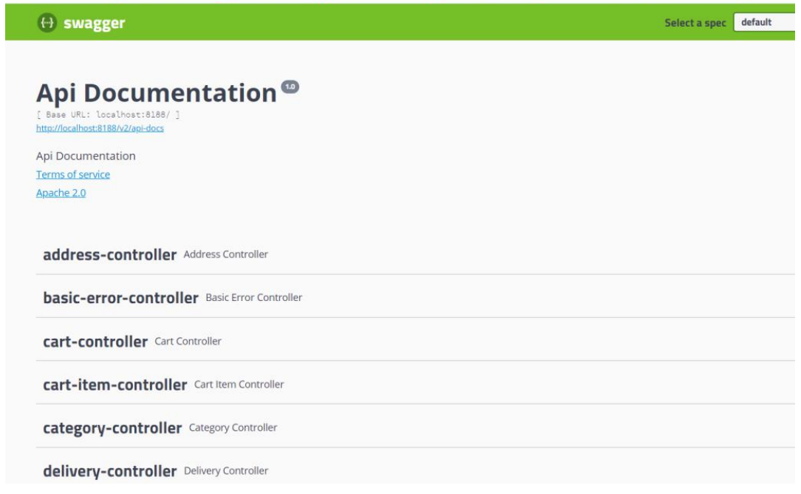
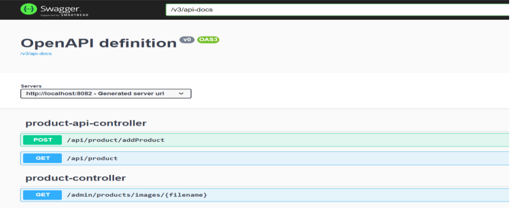

CẤU HÌNH SWAGGER2 VÀ SWAGGER 3 TRÊN SPRING BOOT
# 1. CẤU HÌNH SWAGGER 2 TRÊN SPRING BOOT 2.7.17
## Bước 1: Thêm thư viện
<!-- swagger2 -->
<dependency>
<groupId>io.springfox</groupId>
<artifactId>springfox-swagger2</artifactId>
<version>2.9.2</version>
</dependency>
<dependency>
<groupId>io.springfox</groupId>
<artifactId>springfox-swagger-ui</artifactId>
<version>2.9.2</version>
</dependency>

## Bước 2: Cấu hình Bean
@Bean
    public Docket SWAGGERApi() {
        return new Docket(DocumentationType.SWAGGER_2)
                //.select()
                //.apis(RequestHandlerSelectors.basePackage("webprog")).build();
                .select()
                .apis(RequestHandlerSelectors.any())
                .paths(PathSelectors.any())
                .build();
    }
## Bước 3: Tiêm Bean vào IOC Container
Mở file ....application.java và thêm @EnableSwagger2 vào trên class
@SpringBootApplication
@EnableSwagger2
public class CosmeticApiApplication {

    public static void main (Strings[] args) {
        SpringApplication.run(CosmeticApiApplication.class, args);
    }
}

## Bước 4: Kết quả, chạy project và gõ url : http://localhost:8188/swagger-ui.html

# 2. CẤU HÌNH SWAGGER 3 TRÊN SPRING BOOT 3.1.5
## Bước 1: Thêm thư viện
<!-- swagger3 -->
<dependency>
<groupId>io.springfox</groupId>
<artifactId>springfox-swagger-ui</artifactId>
<version>3.0.0</version>
</dependency>
<dependency>
<groupId>org.springdoc</groupId>
<artifactId>springdoc-openapi-starter-webmvc-ui</artifactId>
<version>2.0.2</version>
</dependency>

## Bước 2: Kết quả, chạy project và gõ url: http://localhost:8082/swagger-ui/index.html
